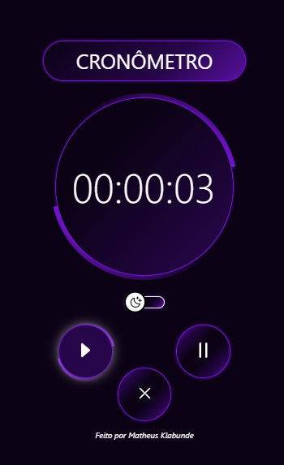
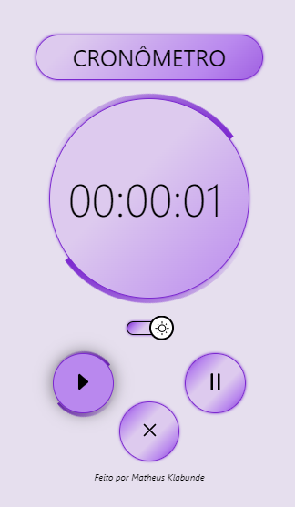

<h1 align="center">Cronômetro Dark & Light</h1>

O Cronômetro Dark & Light foi desenvolvido pensando na flexibilidade do seu uso, tanto para o dia como para a noite, buscando o conforto do usuário.   

  
  

 Acesse o projeto finalizado  <a href="https://matheus-klabunde.github.io/cronometro-dark-light/">aqui</a>

  
 

## Tecnologias

Esse projeto foi desenvolvido com as seguintes tecnologias:

- HTML e CSS
- JavaScript

 

## Desafios 

Nesse projeto, fui em busca de novas habilidades, como:

- CSS
  - @Keyframes para animações;
  - Uso de :root para padronização de cores e imagens, para posteriormente altera-los com maior facilidade;
  - Uso de pseudo-elementos como ::after e ::before, para formatar o enquadramento das animações.

   

- JavaScript
  - addEventListener( ) para colocar funcionalidades no evento de click;
  - toggle( ) para mudar tema dark para light;
  - Date( ) para caracterização do cronômetro em formato de data;
  - setInterval( ) para somar 1 unidade na contagem a cada 1 segundo;
  - setTimeout( ) para que o click do reset volte a estilização inicial após um tempo determinado;
  - clearInterval( ) para limpar a contagem.

 

  ## Licença

  Licença MIT

